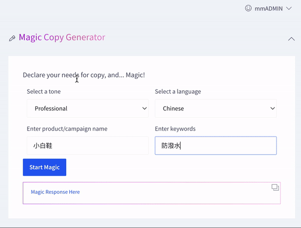

# notiFLY

**The easy-setup notification management service for the company marketing department, providing eDM and web push notification settings with audience filtering and flexible delivery options.**

-   Built eDM and web push notification service through AWS SES and web push API
-   Automated scheduled delivery through cron jobs, ensuring timely and regular notifications
-   Achieved scalable notification delivery by utilizing AWS SQS to trigger Lambda functions, effectively handling high message volumes
-   Utilized AWS CDK for cloud infrastructure deployment to simplify and speed up system setup.
-   Developed a backend [npm package](https://www.npmjs.com/package/notifly-data-wizard) for member data updates to minimize client company’s development effort
-   Empowered marketers with OpenAI-powered copy generator to enhance productivity
-   Implemented RBAC authorization, assigning permissions to users based on their role to ensure secure access control

Website URL: https://gotolive.online

## Demo Account

-   As notiFLY is designed to be an internal system for the company's marketing department, using notiFLY requires logging in, and registration functionality is not provided.
-   Only administrators have the authority to create and delete user accounts.

##### admin:

-   Account: admin@company.com
-   Password: adminpass

##### user:

-   Account: user@company.com
-   Password: userpass

## Main Feature

-   Powerful Segment Filter
    
-   AI Magic Copy Generator
    
-   Flexible Schedule for Delivery Time
    You can set up periodic notifications repeatedly sent at your designated frequency

## Demo - operation flow

##### Overview on the interaction between notiFLY and the client company

-   Imagine you run an e-commerce website called STYLiSH and have decided to integrate notiFLY to send marketing push notifications.

##### Steps

We provide mock client site STYLiSH for you to trial.
Go to STYLiSH (Website URL: https://clientshop.gotolive.online/signin.html)

1. Sign up at STYLiSH
2. Fill out [Member info](https://clientshop.gotolive.online/member_info.html)
3. Accept web push subscription

To this step, your member info and web push subscription info would be saved to database of notiFLY service

Go to notiFLY (Website URL: https://gotolive.online)

4. Set up a [Segment](https://gotolive.online/segment.html) condition that matched the member info you registered on STYLiSH.
5. Set up a notification [Campaign](https://gotolive.online/campaign.html) , choose the Segment you set, and fill out other delivery details.
6. The notification will be sent to you at your designated time.

## Quick system set up

To speed up the onboarding process for companies adopting notiFLY services, we provide :

-   Cloud Deployment: **AWS CDK** is used to accelearte setting up cloud infrastructure and enable version control of infra.
-   Data Exchange: [**NPM package**](https://www.npmjs.com/package/notifly-data-wizard) is provided to update company's member data to notiFLY.
-   Web push: Javascript code provided to set up service worker and enable notification subscription.

## Technologies

### Backend

-   Node.js
-   RESTful API

### Frontend

-   jQuery
-   AJAX
-   HTML
-   CSS
-   Bootstrap

### Database

-   MongoDB Atlas

### Cloud Service

-   AWS CDK
-   AWS Lambda
-   AWS SQS
-   AWS SES
-   AWS S3
-   AWS EC2
-   AWS ELB

### Framework

-   MVC

### Networking

-   HTTPS
-   SSL
-   Domain Name System (DNS)

## Architecture

## MongoDB Collection Schema

## Contact

Min-ju (Alison) Chuang @ alison.mjchuang@gmail.com
